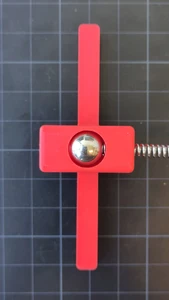
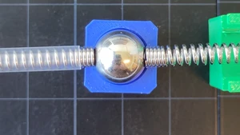
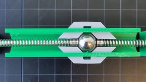
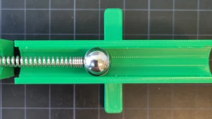
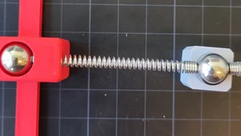
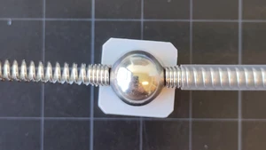

# Workshop virtuele arbeid

% bronbestanden hier: https://github.com/Tom-van-Woudenberg/mechanics-figures-source/tree/main/MOLA

In deze workshop ga je de mechanismes die nodig zijn om virtuele arbeid toe te passen. Dat ga je doen met MOLA.

## Onderdelen
We maken gebruik van de volgende componenten
| MOLA    | Model |
| :--------: | :------: |
|   | |
| |   |
| |   |
|  | |
|  | |
|  | |